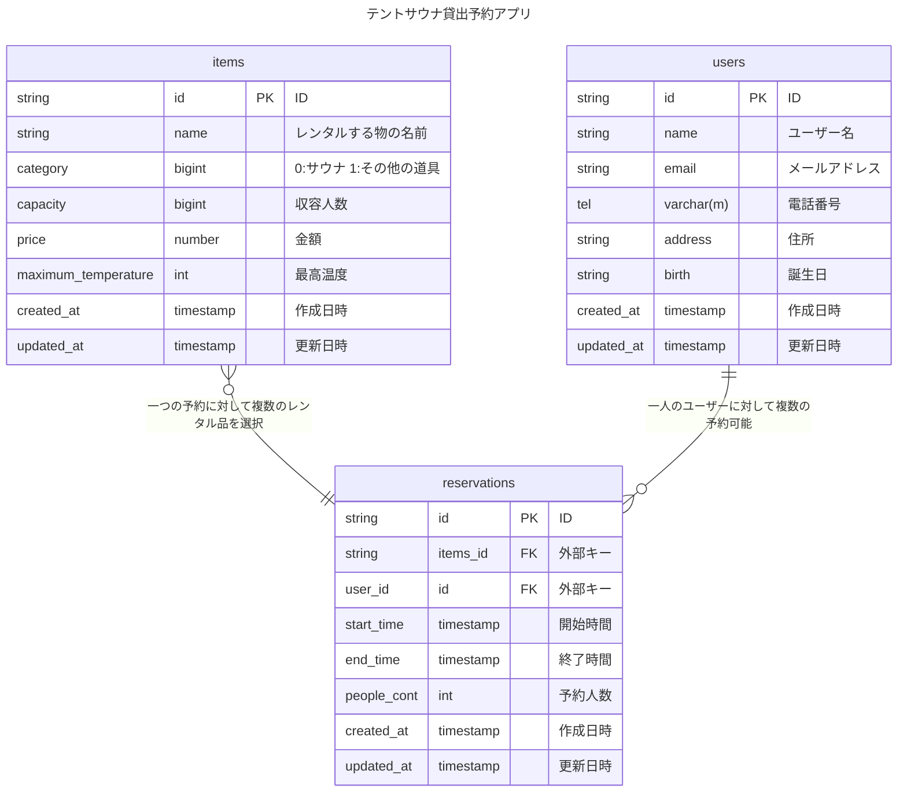

# ER図

```mermaid
---
title: "テントサウナ貸出予約アプリ"
---
erDiagram
    items }o--|| reservations : "一つの予約に対して複数のレンタル品を選択"
    users ||--o{ reservations : "一人のユーザーに対して複数の予約可能"

    users {
      string id PK "ID"
      string name "ユーザー名"
      string email "メールアドレス"
      tel varchar(m) "電話番号"
      string address "住所"
      string birth "誕生日"
      created_at timestamp "作成日時"
      updated_at timestamp "更新日時"
    }

    items {
      string id PK "ID"
      string name "レンタルする物の名前"
      category bigint "0:サウナ 1:その他の道具"
      capacity bigint "収容人数"
      price number "金額"
      maximum_temperature int "最高温度"
      created_at timestamp "作成日時"
      updated_at timestamp "更新日時"
    }

    reservations {
      string id PK "ID"
      string items_id FK "外部キー"
      user_id id FK "外部キー"
      start_time timestamp "開始時間"
      end_time timestamp "終了時間"
      people_cont int "予約人数"
      created_at timestamp "作成日時"
      updated_at timestamp "更新日時"
    }
```